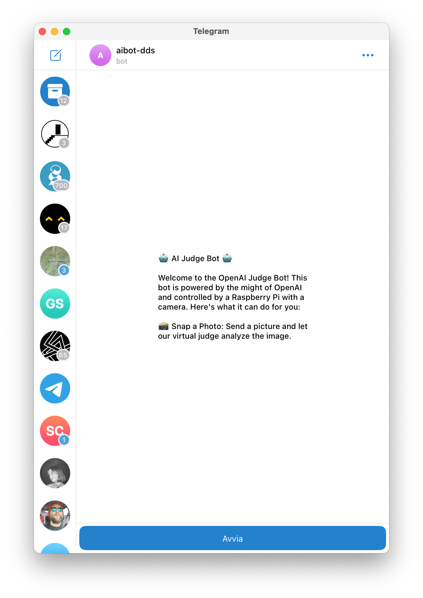
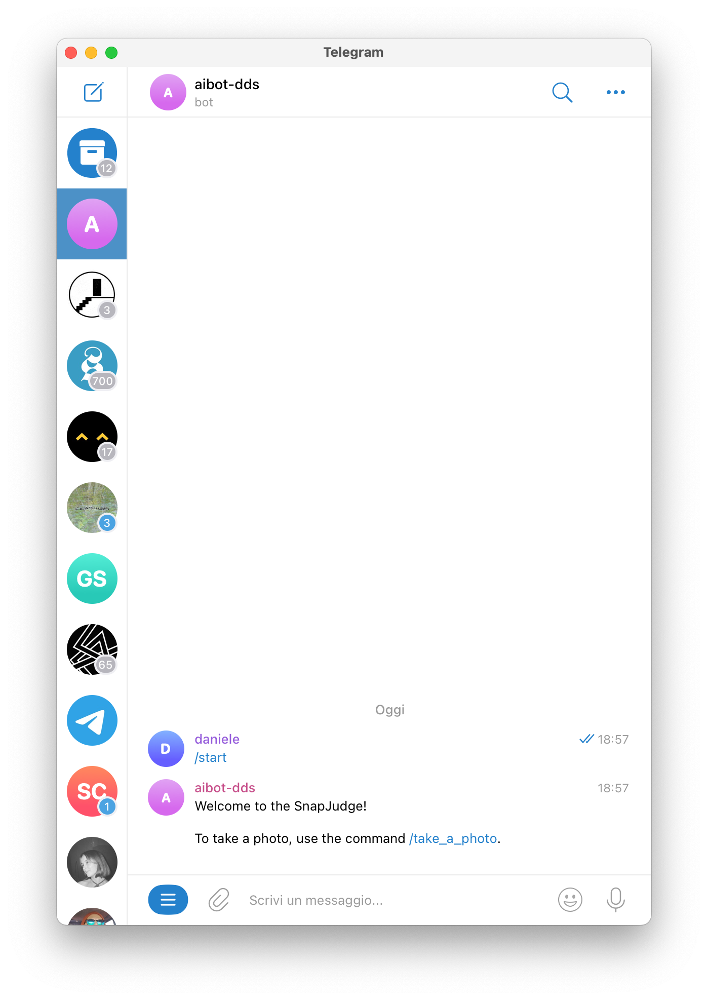
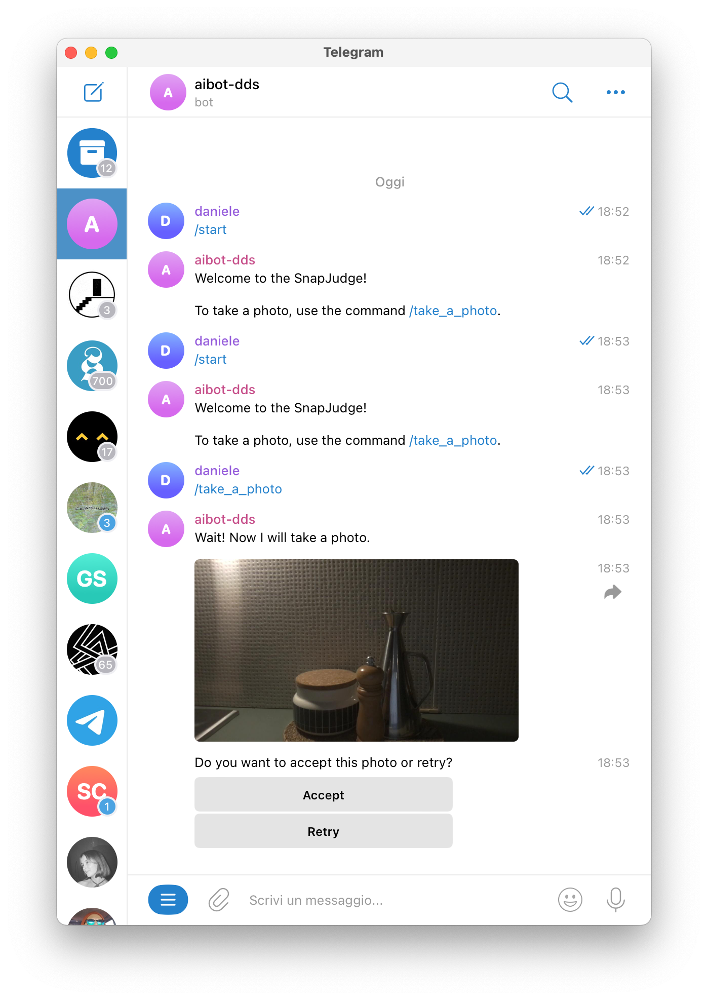
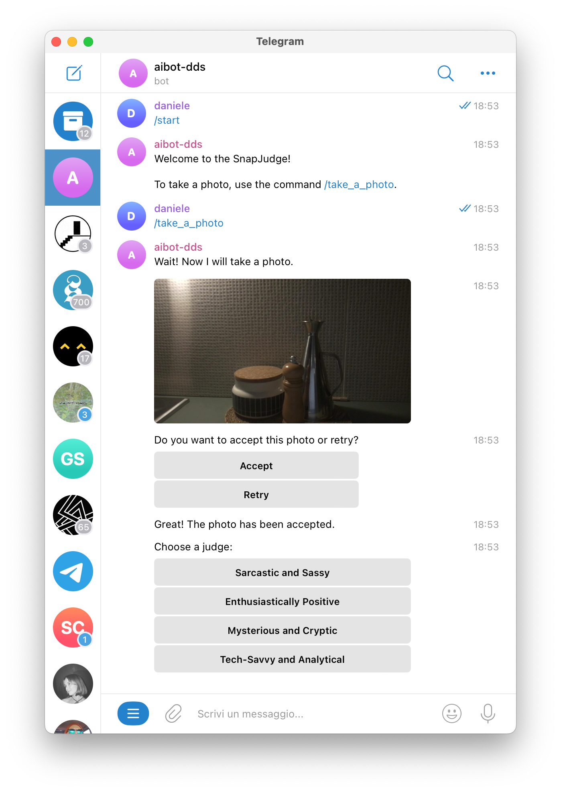
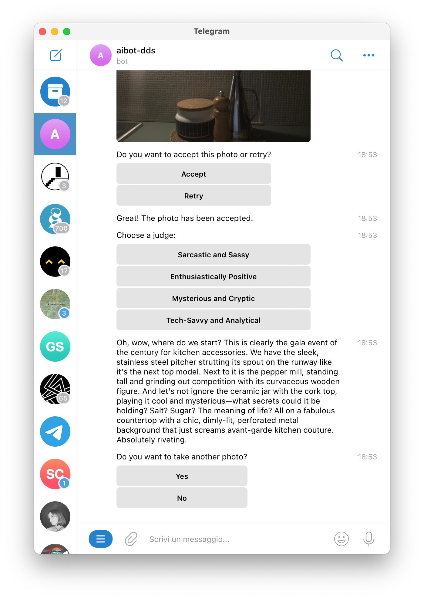

# Creating a Telegram Bot with OpenAI Integration








## Introduction

In this guide, we'll walk through the process of creating a Telegram bot that can take photos, send them to OpenAI and then return the generated text back to the user.

## Prerequisites

1. Python 3 installed on your system.
2. An OpenAI account with a valid API Key.
3. Access token from Telegram bot.
4. Integrate Webcam.

## Step 1: Setup and Configuration


### 1.1 Create a Telegram Bot
To create a Telegram bot, you need to interact with BotFather, which is the official bot provided by Telegram for creating and managing bots. Follow these steps:

1. **Go to BotFather**: Visit [BotFather](https://telegram.me/BotFather) by clicking on the link or searching for "@BotFather" in your Telegram app.

2. **Start Interaction**: Start a chat with BotFather by clicking on the "Start" button or typing "/start".

3. **Create a New Bot**: Type "/newbot" and follow the instructions provided by BotFather. You will be asked to provide a name and a username for your bot. The username must end with "_bot" and be unique.

4. **Get Token**: After successfully creating the bot, BotFather will provide you with a token for your bot. This token is required for authenticating your bot when interacting with the Telegram API. Make sure to save this token securely.

5. **Save Your Token**: Copy the token provided by BotFather and save it. You will need this token later to configure your bot in the script.

By following these steps, you will have successfully created a Telegram bot and obtained the token necessary for integration with the script.


### 1.1 Install Required Libraries

Ensure you have all the necessary libraries installed. You can do this by running the following command:

```bash
pip install telepot opencv-python-headless requests
```

### 1.3 Configure API Credentials
Create a config.json file and fill it out with your API credentials and Telegram bot access token. Here's an example structure:
```bash
{
    "openai_api_key": "YOUR_OPENAI_API_KEY",
    "telegram_bot_token": "YOUR_TELEGRAM_BOT_TOKEN",
    "inline_keyboard_labels": ["Prompt 1", "Prompt 2", "Prompt 3"],
    "default_prompt": "Default Prompt",
    "prompts": ["Prompt 1", "Prompt 2", "Prompt 3"]
}
```
Replace "YOUR_OPENAI_API_KEY" with your OpenAI API key and "YOUR_TELEGRAM_BOT_TOKEN" with your Telegram bot token. You can also customize the inline_keyboard_labels and prompts arrays with your desired options.

## Step 2: Implementing the Telegram Bot
### 2.1 Bot Initialization
Initialize the Telegram bot using the provided access token.
Set up headers for OpenAI API.
Define necessary variables and functions.
### 2.2 Message Handling
Implement a message handler function to process user commands.
Define actions for commands such as 
```
/take_a_photo
/time
/start
```
### 2.3 Taking a Photo
Capture an image using the device's webcam when the */take_a_photo* command is received.
Save the captured image locally.
Encode the image to base64 format for sending via Telegram.
### 2.4 Integrating with OpenAI
Create a payload with the necessary data, including the image URL.
Send the payload to the OpenAI API for text generation.
Process the response and extract the generated text.### 2.5 Sending Responses
Send the generated text back to the user via Telegram.


## Step 3: Running the Bot
Execute the Python script to run the Telegram bot:
```
python aibot-desktop.py
```
## Compatibility
Please note that this guide has been tested on a macOS environment. Feel free to customize and expand upon this bot to suit your specific requirements.


